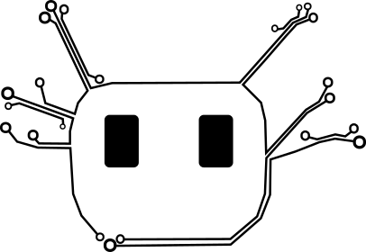
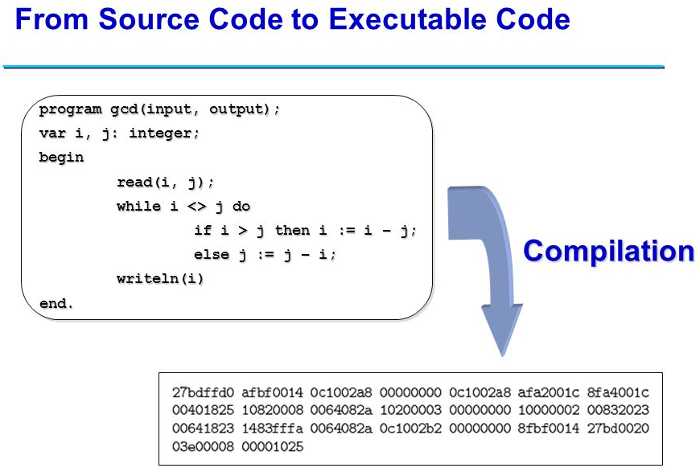
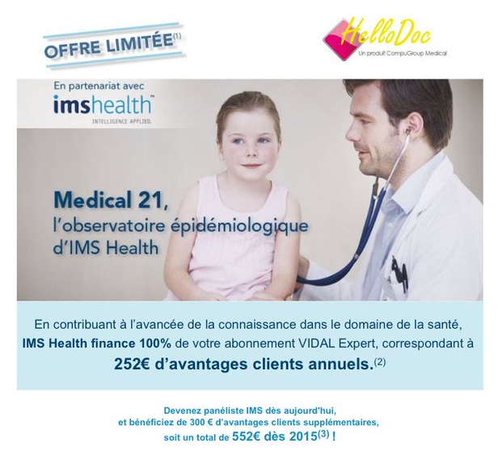
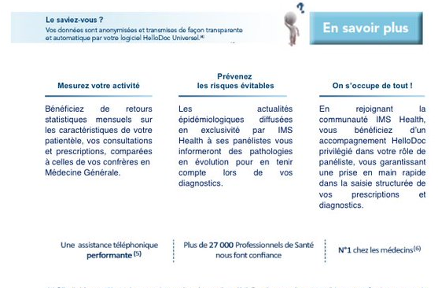

# Logiciel libre, matériel libre, standards libres et santé
Texte: https://github.com/LibreHealthcare/slides
Diaporama: https://gitpitch.com/LibreHealthcare/slides

---
### LibreHealthCare

* Collectif regroupant
    * professionnels de santé
    * développeurs
    * créateurs
    * libristes

+++

### LibreHealthCare
#### Objectifs
* Promouvoir logiciels, matériel et standards libres dans le domaine de la santé
* Mettre en commun les initiatives

Mailing list, wiki, Mastodon, Twitter: https://librehealthcare.org

---

### Qu'est-ce qu'un logiciel libre ?

4 libertés fondamentales de l'utilisateur de logiciel définies par la Free Software Fundation

* 0 la liberté d'exécuter le programme, pour tous les usages
* 1 la liberté d'étudier le fonctionnement du programme et de l'adapter à ses besoins
* 2 la liberté de redistribuer des copies du programme (ce qui implique la possibilité aussi bien de donner que de vendre des copies)
* 3 la liberté d'améliorer le programme et de distribuer ces améliorations au public, pour en faire profiter toute la communauté  

+++

L'accès au code source est une condition d'exercice des libertés 1 et 3.

+++    

 * Un logiciel libre est un logiciel qui respecte ces 4 libertés.
 * Tout logiciel qui ne respecte pas l'ensemble de ces 4 libertés est 1 logiciel non libre, encore appelé logiciel privateur (de libertés).
 
+++
 
### Code source

---

### Qui controle qui?

"Si l'utilisateur ne contrôle pas le logiciel, c'est le logiciel qui contrôle l'utilisateur."

Richard Stallman

---
## Matériel libre

* Extrapolation du logiciel
* Mouvance DIY
* Prise en compte économique

---

## Standards ouverts

* Spécification techniques publiques
* Pas de restriction d'accès ou de mise en œuvre
* Interopérabilité

---

## Intérêt dans le monde de la santé

### Pour les patients
### Pour les soignants

---

# Intérêt pour les patients

---
## Intérêt pour les soignants
### Logiciel orphelin

#### Dr Stallman
 
* Utilise 1 logiciel libre OpenMed qu'il trouve génial, développé par l'entreprise FreeSoft Inc.

+++

* L'entreprise FreeSoft fait de mauvaises affaires et finit par fermer

+++

* Dr Stallman contacte les autres médecins utilisateurs du logiciel OpenLogiciel, qui décident de se regrouper en 1 association OpenDocAsso.

+++

* Dr Stallman, président d'OpenDocAsso, confie le développement d'un fork d'OpenLogiciel à l'entreprise Cliss 21
* Le logiciel, renommé OpenDoc, est identique au départ (liberté 2)

+++

* Après avoir étudié en détail le code source du logiciel (liberté 1) le nouvel éditeur ajoute des nouvelles fonctionnalités (liberté 3)

Dr Stallman et les membres de l'association sont satisfaits d'avoir fait le choix d'1 logiciel libre au départ.

---

## Intérêt pour les soignants I
### Logiciel orphelin
#### Dr Gates

* Utilise 1 logiciel privateur ProprietaryMed
* Editeur: Macro$oft
* Adore son logiciel
* Discute souvent sur le forum des utilisateurs où il aide ses collègues

+++

* Les quelques centaines d'utilisateurs ne suffisent pas à assurer la pérennité de Macro$oft dépassée par les exigences toujours croissantes liées au contrôle de l'activité par la ROSP
* Macro$oft fait faillite

+++

* logiciel orphelin
* logiciel n'évolue plus
* Dr Gates peste sur le forum des utilisateurs
* Forum abandonné

+++

* Dr Gates veut avoir les sous de la ROSP
* Change de logiciel pour HelloTruc
  * le + gros logiciel
   * 1 éditeur "indépendant": ImagineAllThePeople
   * sans publicité
    * what could go wrong? :-)

+++    

* Paye 500€ pour la récupération des données à HelloTruc
   * informations de structuration perdues
   * consultations mises en bloc dans 1 seule page sans structuration
   * pas d'accès au code source -> personne ne sait comment était structurée la base de données de ProprietaryMed
   * fouiller et reconstituer la structure est:
     * fastidieux
     * long
     * coût+++

---

## Intérêt pour les soignants II
### Retour sur investissement

### Dr Stallman
Après avoir confié le développement du logiciel OpenDoc à l'entreprise Cliss 21, il décide de collaborer activement avec les développeurs pour améliorer le logiciel

+++

* il contribue à améliorer son outil professionnel
* le code qu'il teste et qu'il aide à produire restera libre
* les améliorations qu'il propose ne pourront pas lui échapper
* le logiciel est libre pour toujours
* le logiciel (et même ses dérivés si la licence libre est copyleft) resteront à sa disposition

+++

* Un logiciel libre peut être vendu: vous l'achetez, mais vous recevez aussi le code source et toutes les libertés du logiciel libre
* Un logiciel libre ne peut pas être "racheté" et confisqué comme 1 logiciel privateur.

Dr Stallman est décidément très satisfait d'avoir fait le choix initial d'1 logiciel libre. ;-)

---

### Dr Gates

En début d'activité de médecin généraliste, le Dr Gates s'était beaucoup investi dans son 1er logiciel privateur, dBMed, lancé en 1987:
* crée 1 forum utilisateurs
* anime 1 communauté vibrante

+++

Après le rachat de dbMed par CLM (CEGEDIM Logiciels Médicaux), il a travaillé pendant 1 an avec les développeurs qui étaient déjà en poste chez le précédent éditeur pour mettre à jour le logiciel:
* Sortie d'1 version "millenium"
* Dr Gates doit être dédommagé pour son travail: 18C (18 prix d'1 consultation)
* 1 an de travail payé comme 1 journée de travail
* le nouveau directeur ne veut finalement pas le payer
* tous les anciens développeurs de dBmed sont licenciés

+++

* Logique: l'entreprise CLM a déjà son logiciel principal Crossway dans lequel elle a lourdement investi.
* Pourquoi continuer à développer 1 logiciel obsolète quand on peut stopper son développement et forcer ses utilisateurs à migrer?

+++

Mais la migration va couter très cher:
* récupération des données 400€
* maintenance 600€ par an.

+++

Le Dr Gates regrette vraiment d'avoir investi son argent et son temps dans 1 logiciel privateur qui a été revendu puis abandonné.

Cette histoire est calquée sur des faits réels: http://espacedbmed.chez-alice.fr/let_ouv.htm

+++

### Quizz
Qu'a racheté CEGEDIM en réalité?

1. 1 entreprise aux abois
2. 1 vieux logiciel dépassé
3. des milliers de médecins captifs d'1 logiciel privateur

Batir 1 "communauté d'utilisateurs" sur 1 logiciel non libre est 1 stratégie risquée.

---

## Intérêt pour les soignants II
### Dérives: publicité, malware

### Dr Stallman

10 ans après... Dr Stallman a changé de logiciel mais il reste libre.

* Satisfait de son nouveau logiciel libre UltraOpenDoc de la société UltraLibreDev
* Mise à jour: 1 écran publicitaire s'affiche juste avant la prescription...
* Forum utilisateurs: 100 utilisateurs s'insurgent
* Si la pub n'est pas retiré immédiatement, on forke le logiciel et on le confie à FramaDev, connue pour refuser toute publicité
* UltraLibreDev s'excuse et retire la pub du code le lendemain

## Intérêt pour les soignants II
### Dérives: publicité
### Dr Gates

Dr Gates misait tout sur les éditions ImageAllThePeople. Avec un nom pareil, ce sont sûrement des gens chouettes, ils ont dû faire mai 68.

* Mise à jour: 1 écran publicitaire s'affiche juste avant la prescription...
* Forum utilisateurs: 100 utilisateurs s'insurgent
* Ils créent 1 pétition en ligne sur Avaaz
  * [Madame Marisol Touraine, Ministre de la Santé: interdisez la publicité pour médicaments dans les logiciels médicaux](https://secure.avaaz.org/fr/petition/Madame_Marisol_Touraine_Ministre_de_la_Sante_interdire_la_publicite_pour_medicaments_dans_les_logiciels_medicaux/?pv=9)
  * 1 061 signatures!!! C'est l'insurrection qui vient...
  
+++

* 2017: il y a toujours de la pub sur le logiciel HelloTruc
* Les utilisateurs continuent à payer
* ImagineAllThePeople l'éditeur "indépendant" number 1 cool soixante-huitard a été racheté par WorldCompany... (cf "Retour sur investissement")
* Les utilisateurs ne peuvent plus se plaindre sur le forum car il a été fermé

  
---

## Intérêt pour les soignants II
### Dérives: malware

#### Dr Stallman
Pas de malware dans son logiciel libre:
* code source accessible
* rien n'est secret dans le fonctionnement du logiciel
* difficile d'insérer 1 malware

--- 
#### Dr Gates
IMS Health, géant des données de santé, a négocié avec WorldCompany pour installer d'office le module "épidémiologique" sur son logiciel HelloTruc.
* codage et structuration des donnée des consultations
* envoi des données vers le serveur IMS Health
* réduction de quelques centaines d'€ sur l'abonnement à BiduleExpert la base de données sur les médicaments

+++

Dr Gates sait que derrière l'excuse "épidémiologique", il s'agit de:
* recueillir des données précieuses sur ses habitudes de prescription
* revendre les données bien plus cher à l'industrie pharmaceutique

* Il demande le retrait du module IMS Health de son logiciel
* Refus de l'éditeur

+++

+++

---

#Intérêt pour les soignants III

---

## Projets libres
